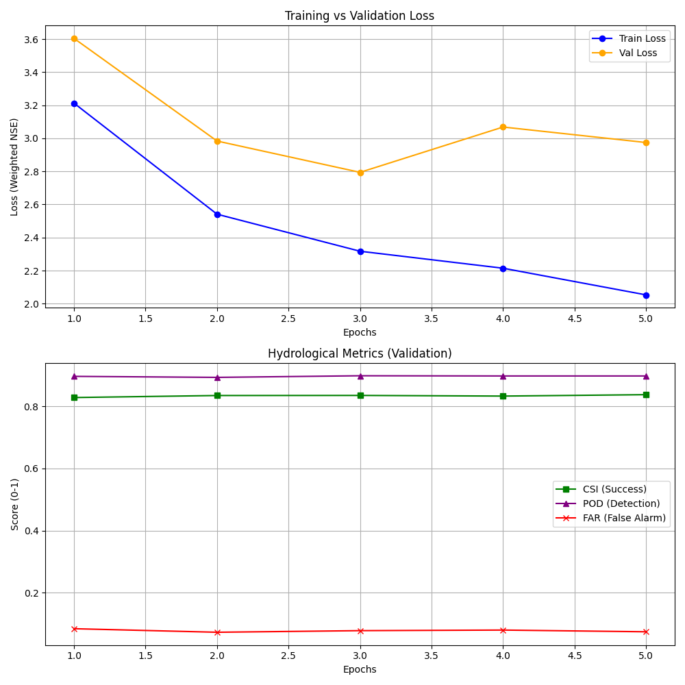
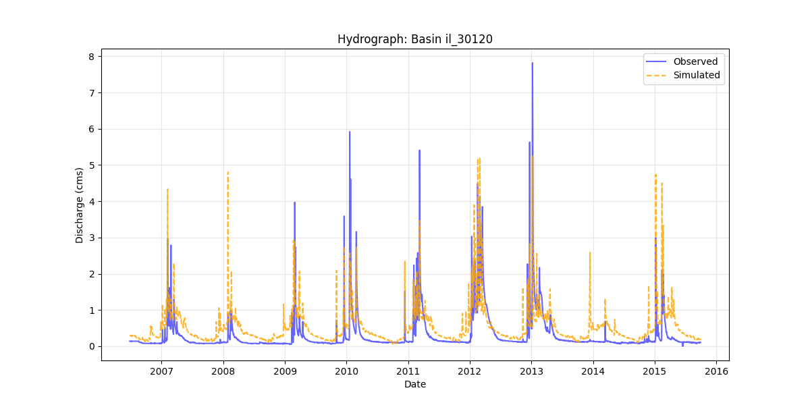
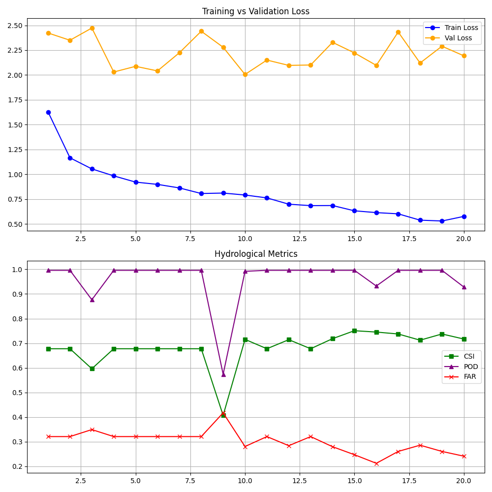
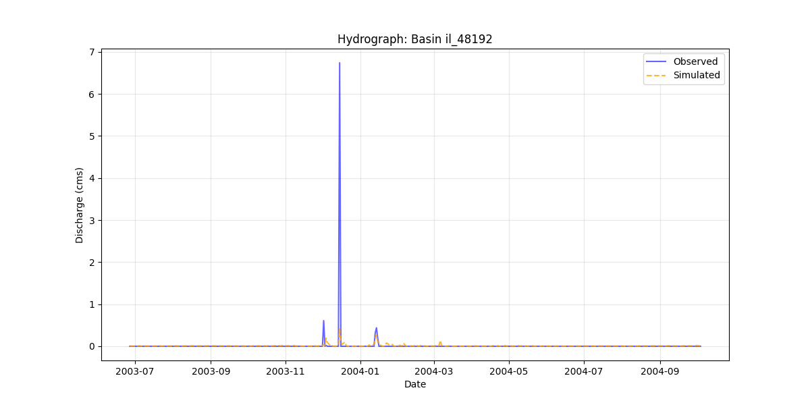

# Flash Flood Prediction using EA-LSTM

## Project Overview
This project implements a deep learning system for predicting flash floods in Israel using the **Entity-Aware Long Short-Term Memory (EA-LSTM)** architecture. Unlike standard LSTMs, this model is specifically designed to integrate dynamic meteorological forcing data with static catchment attributes to provide precise discharge forecasts across diverse hydrological basins.

## 1. Model Architecture: EA-LSTM
The core of this project is the **EA-LSTM**, which is tailored for rainfall-runoff modeling by distinguishing between dynamic and static inputs.

* **Logic**: Standard LSTMs treat static attributes (e.g., soil type, basin area) as dynamic inputs that repeat daily, which often hinders the model's ability to learn long-term spatial contexts.
* **Implementation**: I implemented a specialized **Input Gate ($i$)** that processes only the static attributes ($x_s$) to modulate the cell state, while the remaining gates handle the dynamic time-series data ($x_d$).
* **Importance**: This allows the model to "understand" the specific context of each basin (e.g., a desert basin reacts differently to rain than a mountainous one) before processing the rainfall sequences.

## 2. Optimized Training & Loss Function
The training process is governed by a custom loss function designed to handle hydrological variance and prioritize extreme events.

### Weighted NSE Loss
I implemented a custom Loss function based on the following mathematical framework:

* **Variance Scaling**: The error is normalized by the basin's natural variance ($\sigma_{basin,b}^2$), ensuring that basins with naturally high discharge don't overwhelm the training process.
* **Flow Weighting ($W_{(b,t)}$)**: To focus on floods rather than low-flow days, I utilized a weighting factor based on observed discharge:

### Mini-Batch Gradient Descent
* **Implementation**: I used the **Adam optimizer** with a batch size of 256.
* **Catchment Sampling**: Each batch contains random samples from various basins. This forces the model to learn a **global hydrological mapping** instead of over-fitting to the behavior of a single river.

## 3. Data Processing & Hydrological Integration
* **Return Periods & Gumbel Distribution**: I calculated discharge thresholds for various return periods (Q2, Q5, etc.) using the **Gumbel distribution** on Annual Maxima Series (AMS).
* **Handling Missing Values**: I applied linear interpolation (with a strict limit) followed by dropping incomplete sequences to ensure data quality without introducing significant bias.
* **Sensor Bias & Drift**: To mitigate instrument errors and drift, I performed **individual channel-wise normalization** (Z-Score) for each basin.
* **Time Encoding**: I encoded the day-of-year into **Sin/Cos components** to preserve seasonal cycles.
* **Efficiency**: I utilized **Python dictionaries and PyTorch Tensors** to optimize data fetching during training.

## 4. Evaluation Metrics
I evaluated the model using a **Time-Based Split** (Train: 1980-2000, Val: 2000-2005, Test: 2005-2015). For flood detection accuracy, I used the following categorical metrics:

* **POD (Probability of Detection)**: 
  $$POD = \frac{Hits}{Hits + Misses}$$
* **FAR (False Alarm Ratio)**: 
  $$FAR = \frac{False\ Alarms}{Hits + False\ Alarms}$$
* **CSI (Critical Success Index)**: 
  $$CSI = \frac{Hits}{Hits + Misses + False\ Alarms}$$

## 5. Inference and Prediction
Once the model is trained and the `best_model.pth` is saved, I use the `predict.py` script to generate discharge forecasts for the **Test set (2005-2015)**.

* **Loading the Model**: The script re-instantiates the EA-LSTM architecture and loads the optimized weights from the training phase.
* **Inverse Transformation**: Since the model operates on normalized Z-Score data, I implemented an inverse transform to convert the outputs back to physical units:
  $$Discharge_{(CMS)} = (Prediction_{(Z-score)} \times \sigma_{target}) + \mu_{target}$$
* **Physical Constraints**: I applied a **clipping** operation to ensure all predicted values are non-negative.

## 6. Experimental Results & Analysis

I conducted two distinct experimental phases to characterize the model's behavior under different constraints. These experiments demonstrate the trade-off between training duration, dataset size, and generalization capability.

### Phase A: Pipeline Validation (Underfitting)
* **Setup**: Large tarining dataset (20 years), Short training (5 Epochs).
* **Goal**: To verify the end-to-end pipeline and baseline stability.

**Observations:**
* The metrics (CSI, POD) stabilized quickly, and the validation loss showed a moderate decrease.
* **Hydrograph Analysis**: The hydrograph demonstrates that the model successfully captures the **timing** of flow events. However, it struggles with accurate **magnitude estimation**, exhibiting inconsistency where predictions sometimes overshoot or undershoot the observed peaks.
* **Conclusion**: This indicates **Underfitting**. The model learned the "average" behavior but lacked sufficient training iterations to capture extreme events.

### Phase B: Capacity Analysis (Overfitting)
* **Setup**: Reduced training dataset (5 years), Extended training (20 Epochs).
* **Goal**: To test the model's learning capacity and convergence on specific data.

**Observations:**
* **Sharp Loss Drop**: The Training Loss (Blue line) dropped significantly, proving the EA-LSTM has the capacity to learn complex patterns.
* **Generalization Gap**: However, the Validation Loss (Orange line) stagnated, and metrics did not improve correspondingly.
* **Conclusion**: This indicates **Overfitting**. The model "memorized" the small training set. While it performs well on training data, it remains conservative on the test set because it hasn't seen enough historical variance to generalize to new years.

**Summary:** The comparison confirms that the architecture is sound (Phase B proof) but requires the full 35-year dataset to prevent overfitting, alongside Early Stopping to prevent the stagnation seen in Phase B.

## 7. Limitations & Future Work
Based on the experimental analysis, I have defined the following roadmap:

* **Data Augmentation (Gaussian Noise)**: Injecting additive Gaussian noise to the static and dynamic inputs during training. This technique is expected to improve model robustness and reduce overfitting by preventing the network from relying on specific artifacts in the training data.
* **Model Interpretability (Morris Method)**: Implementing the **Morris Method** for global sensitivity analysis. This will allow us to quantify which static attributes (e.g., soil type, slope) and dynamic forcings have the most significant impact on flood predictions, transforming the "black-box" model into an explainable hydrological tool.
* **Early Stopping / Early Dropping**: Implementing an automated mechanism to halt training when validation loss stagnates (as seen in Phase B). This is crucial to prevent overfitting and save computational resources.
* **Full Dataset Training**: Scaling the training back to the full 35-year historical record. This will provide the variance needed to solve the overfitting issue and improve peak detection.
* **Leave-Region-Out**: Testing the model's spatial generalization by withholding entire geographic regions.
* **Downstream/Upstream Leakage**: Grouping hydrologically connected basins into the same data splits to prevent information leakage through water flow correlation.
* **Quality Flags**: Integrating sensor reliability metadata to weight the loss function.
* **F1-Score & KGE**: Adding the **F1-Score** and **Kling-Gupta Efficiency (KGE)** for better performance evaluation.
